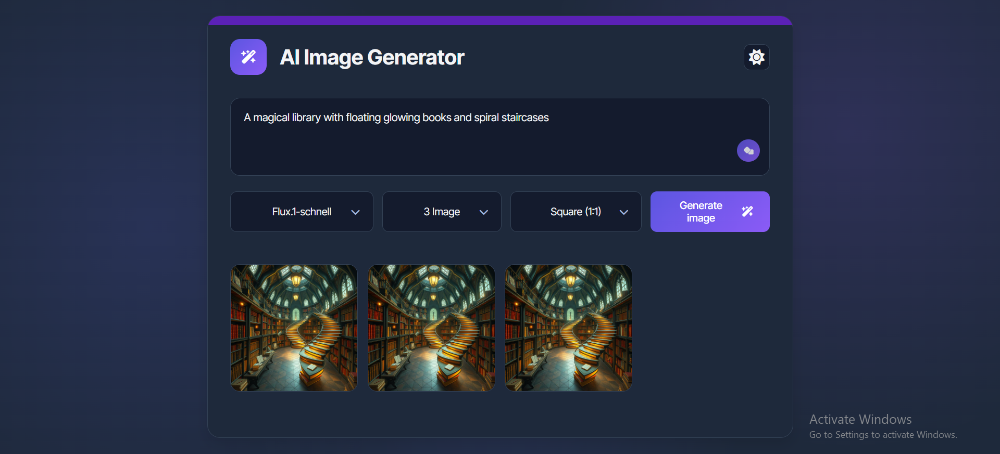

# AI-Image-Generator
# 🖼️ AI Image Generator – Codveda Internship Task

This project is part of my **Front-End Development Internship at Codveda Technologies**.  
It allows users to generate **AI-powered images** based on text prompts using the **Hugging Face Inference API**.

---

## 🚀 Features
- Generate images from **custom text prompts**.
- **AI models** supported (Flux.1-schnell).
- Choose number of images (up to 4 per request).
- Select **aspect ratio** (Square, Portrait, Landscape).
- Light/Dark **theme toggle** with localStorage persistence.
- Download generated images easily.

---

## 📸 Preview
  
---

## 🛠️ Technologies Used
- **HTML5**
- **CSS3**
- **JavaScript (Fetch API)**
- **Hugging Face API**

---

## ⚙️ How It Works
1. Enter a text prompt or use random examples.  
2. Select model, image count, and aspect ratio.  
3. Click **Generate** → API sends request to Hugging Face.  
4. Images are generated and displayed in the gallery grid.  

⚠️ *Due to API limitations, only 4 images per request are supported in the free tier.*  

---

⚠️ Note: For security reasons, the Hugging Face API key is not included in this repository.  
To make the demo work, please add your own key in config.js (see config.example.js).

## 🎯 Internship Context
This project was developed as **Task 2 (REST API Integration)** during my internship with **Codveda Technologies**.  
It demonstrates my ability to integrate external REST APIs and build a responsive, interactive front-end project.  

---

## 📬 Contact
👤 **Hossam Hamad Abd-Elazem Abd-Elghani**  
💼 Front-End Developer Intern @ Codveda Technologies  
🔗 [LinkedIn Profile](https://www.linkedin.com/in/hossam-hamad/)
